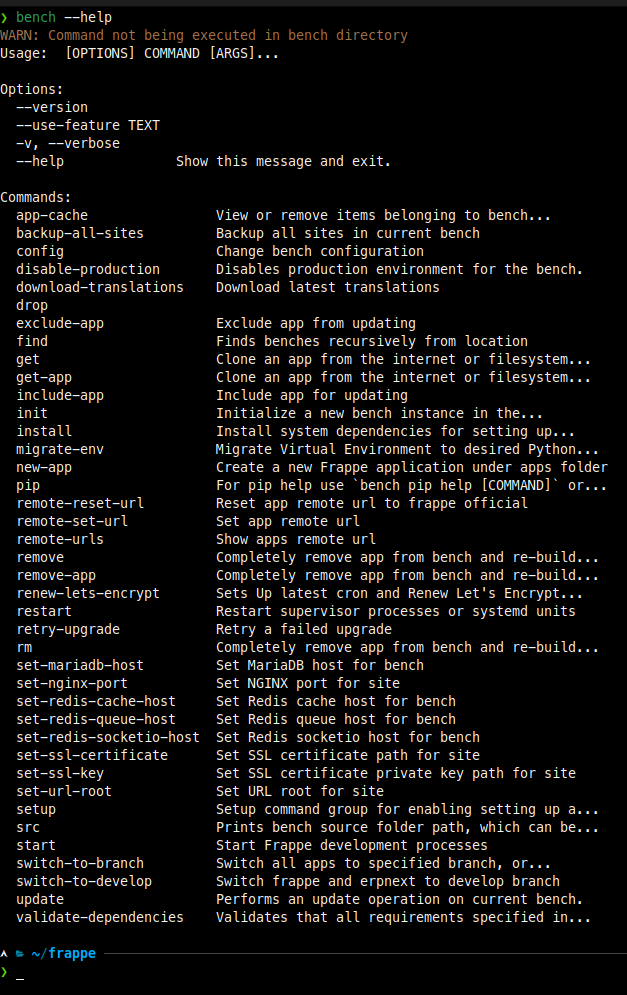

<div align="center">


## Bench
**CLI to manage Frappe applications**


[](https://www.python.org/downloads/)
[](https://pypi.org/project/frappe-bench)


</div>

## Bench

Bench is a command-line utility that helps you to install, update, and manage multiple sites for Frappe applications on [*nix systems](https://en.wikipedia.org/wiki/Unix-like) for development and production.

## Key features

Bench helps you set up and manage your frappe sites with ease. Here are some of the key features:
- Initializing a new bench to work on sites and apps
- Creating a new frappe site
- Creating and installing apps that can be used on the sites
- Managing frappe sites
- Managing site backups

## Installation

A typical bench setup provides two types of environments &mdash; Development and Production.

The setup for each of these installations can be achieved in multiple ways:

 - [Containerized Installation](#containerized-installation)
 - [Manual Installation](https://docs.frappe.io/framework/user/en/tutorial/install-and-setup-bench)

We recommend using Docker Installation to setup a Production Environment. For Development, you may choose either of the two methods to setup an instance.

Otherwise, if you are looking to evaluate Frappe apps without the hassle of managing hosting yourself, you can try them on [Frappe Cloud](https://frappecloud.com/).

<div>
	<a href="https://frappecloud.com/dashboard/signup" target="_blank">
		<picture>
			<source media="(prefers-color-scheme: dark)" srcset="https://frappe.io/files/try-on-fc-white.png">
			
		</picture>
	</a>
</div>

### Containerized Installation

A Frappe instance can be setup and replicated easily using [Docker](https://docker.com). The officially supported Docker installation can be used to setup either of both Development and Production environments.

To setup either of the environments, you will need to clone the official docker repository:

```sh
git clone https://github.com/frappe/frappe_docker.git
```

A quick setup guide for both the environments can be found below. For more details, check out the [Frappe Docker Repository](https://github.com/frappe/frappe_docker).

### Easy Install Script

The Easy Install script should get you going with a Frappe setup with minimal manual intervention and effort.

This script uses Docker with the [Frappe Docker Repository](https://github.com/frappe/frappe_docker) and can be used for both Development setup and Production setup.

#### Setup

Download the Easy Install script and execute it:

```sh
wget https://raw.githubusercontent.com/frappe/bench/develop/easy-install.py
python3 easy-install.py deploy --email=user@domain.tld --sitename=subdomain.domain.tld --app=erpnext
```

This script will install docker on your system and will fetch the required containers, setup bench and a default ERPNext instance.

The script will generate MySQL root password and an Administrator password for the Frappe/ERPNext instance, which will then be saved under `$HOME/passwords.txt` of the user used to setup the instance.
It will also generate a new compose file under `$HOME/<project-name>-compose.yml`.

When the setup is complete, you will be able to access the system at `http://<your-server-ip>`, wherein you can use the Administrator password to login.

#### Arguments

Here are the arguments for the easy-install script

<details>
<summary><b>Build custom images</b></summary>

```txt
usage: easy-install.py build [-h] [-n PROJECT] [-i IMAGE] [-q] [-m HTTP_PORT] [-v VERSION] [-a APPS] [-s SITES] [-e EMAIL]
                             [-p] [-r FRAPPE_PATH] [-b FRAPPE_BRANCH] [-j APPS_JSON] [-t TAGS] [-c CONTAINERFILE]
                             [-y PYTHON_VERSION] [-d NODE_VERSION] [-x] [-u]

options:
  -h, --help            show this help message and exit
  -n PROJECT, --project PROJECT
                        Project Name
  -g, --backup-schedule BACKUP_SCHEDULE
                        Backup schedule cronstring, default: "@every 6h"
  -i IMAGE, --image IMAGE
                        Full Image Name
  -q, --no-ssl          No https
  -m HTTP_PORT, --http-port HTTP_PORT
                        Http port in case of no-ssl
  -v VERSION, --version VERSION
                        ERPNext version to install, defaults to latest stable
  -a APPS, --app APPS   list of app(s) to be installed
  -s SITES, --sitename SITES
                        Site Name(s) for your production bench
  -e EMAIL, --email EMAIL
                        Add email for the SSL.
  -p, --push            Push the built image to registry
  -r FRAPPE_PATH, --frappe-path FRAPPE_PATH
                        Frappe Repository to use, default: https://github.com/frappe/frappe
  -b FRAPPE_BRANCH, --frappe-branch FRAPPE_BRANCH
                        Frappe branch to use, default: version-15
  -j APPS_JSON, --apps-json APPS_JSON
                        Path to apps json, default: frappe_docker/development/apps-example.json
  -t TAGS, --tag TAGS   Full Image Name(s), default: custom-apps:latest
  -c CONTAINERFILE, --containerfile CONTAINERFILE
                        Path to Containerfile: images/layered/Containerfile
  -y PYTHON_VERSION, --python-version PYTHON_VERSION
                        Python Version, default: 3.11.6
  -d NODE_VERSION, --node-version NODE_VERSION
                        NodeJS Version, default: 18.18.2
  -x, --deploy          Deploy after build
  -u, --upgrade         Upgrade after build
```
</details>

<details>
<summary><b>Deploy using compose</b></summary>

```txt
usage: easy-install.py deploy [-h] [-n PROJECT] [-i IMAGE] [-q] [-m HTTP_PORT] [-v VERSION] [-a APPS] [-s SITES] [-e EMAIL]

options:
  -h, --help            show this help message and exit
  -n PROJECT, --project PROJECT
                        Project Name
  -g, --backup-schedule BACKUP_SCHEDULE
                        Backup schedule cronstring, default: "@every 6h"
  -i IMAGE, --image IMAGE
                        Full Image Name
  -q, --no-ssl          No https
  -m HTTP_PORT, --http-port HTTP_PORT
                        Http port in case of no-ssl
  -v VERSION, --version VERSION
                        ERPNext version to install, defaults to latest stable
  -a APPS, --app APPS   list of app(s) to be installed
  -s SITES, --sitename SITES
                        Site Name(s) for your production bench
  -e EMAIL, --email EMAIL
                        Add email for the SSL.
```
</details>

<details>
<summary><b>Upgrade existing project</b></summary>

```txt
usage: easy-install.py upgrade [-h] [-n PROJECT] [-i IMAGE] [-q] [-m HTTP_PORT] [-v VERSION]

options:
  -h, --help            show this help message and exit
  -n PROJECT, --project PROJECT
                        Project Name
  -g, --backup-schedule BACKUP_SCHEDULE
                        Backup schedule cronstring, default: "@every 6h"
  -i IMAGE, --image IMAGE
                        Full Image Name
  -q, --no-ssl          No https
  -m HTTP_PORT, --http-port HTTP_PORT
                        Http port in case of no-ssl
  -v VERSION, --version VERSION
                        ERPNext or image version to install, defaults to latest stable
```
</details>

<details>
<summary><b>Development setup using compose</b></summary>

```txt
usage: easy-install.py develop [-h] [-n PROJECT]

options:
  -h, --help            show this help message and exit
  -n PROJECT, --project PROJECT
                        Compose project name
```
</details>

<details>
<summary><b>Exec into existing project</b></summary>

```txt
usage: easy-install.py exec [-h] [-n PROJECT]

options:
  -h, --help            show this help message and exit
  -n PROJECT, --project PROJECT
                        Project Name
```
</details>

To use custom apps, you need to create a json file with list of apps and pass it to build command.

Example apps.json

```json
[
  {
    "url": "https://github.com/frappe/wiki.git",
    "branch": "master"
  }
]
```

Execute following command to build and deploy above apps:

```sh
$ python3 easy-install.py build \
	--tag=ghcr.io/org/repo/custom-apps:latest \
	--push \
	--image=ghcr.io/org/repo/custom-apps \
	--version=latest \
	--deploy \
	--project=actions_test \
	--email=test@frappe.io \
	--apps-json=apps.json \
	--app=wiki
```

Note:

- `--tag`, tag to set for built image, can be multiple.
- `--push`, push the built image.
- `--image`, the image to use when starting docker compose project.
- `--version`, the version to use when starting docker compose project.
- `--app`, app to install on site creation, can be multiple.
- `--deploy`, flag to deploy after build/push is complete
- `--project=actions_test`, name of the project, compose file with project name will be stored in user home directory.
- `--email=test@frappe.io`, valid email for letsencrypt certificate expiry notification.
- `--apps-json`, path to json file with list of apps to be added to bench.

#### Troubleshooting

In case the setup fails, the log file is saved under `$HOME/easy-install.log`. You may then

- Create an Issue in this repository with the log file attached.

## Basic Usage

**Note:** Apart from `bench init`, all other bench commands are expected to be run in the respective bench directory.

 * Create a new bench:

	```sh
	$ bench init [bench-name]
	```

 * Add a site under current bench:

	```sh
	$ bench new-site [site-name]
	```
	- **Optional**: If the database for the site does not reside on localhost or listens on a custom port, you can use the flags `--db-host` to set a custom host and/or `--db-port` to set a custom port.

		```sh
		$ bench new-site [site-name] --db-host [custom-db-host-ip] --db-port [custom-db-port]
		```

 * Download and add applications to bench:

	```sh
	$ bench get-app [app-name] [app-link]
	```

 * Install apps on a particular site

	```sh
	$ bench --site [site-name] install-app [app-name]
	```

 * Start bench (only for development)

	```sh
	$ bench start
	```

 * Show bench help:

	```sh
	$ bench --help
	```


For more in-depth information on commands and their usage, follow [Commands and Usage](https://github.com/frappe/bench/blob/develop/docs/commands_and_usage.md). As for a consolidated list of bench commands, check out [Bench Usage](https://github.com/frappe/bench/blob/develop/docs/bench_usage.md).




## Custom Bench Commands

If you wish to extend the capabilities of bench with your own custom Frappe Application, you may follow [Adding Custom Bench Commands](https://github.com/frappe/bench/blob/develop/docs/bench_custom_cmd.md).


## Guides

- [Configuring HTTPS](https://docs.frappe.io/framework/user/en/bench/guides/configuring-https)
- [Using Let's Encrypt to setup HTTPS](https://docs.frappe.io/framework/user/en/bench/guides/lets-encrypt-ssl-setup)
- [Diagnosing the Scheduler](https://docs.frappe.io/framework/user/en/bench/guides/diagnosing-the-scheduler)
- [Change Hostname](https://docs.frappe.io/framework/user/en/bench/guides/adding-custom-domains)
- [Manual Setup](https://docs.frappe.io/framework/user/en/tutorial/install-and-setup-bench)
- [Setup Production](https://docs.frappe.io/framework/user/en/bench/guides/setup-production)
- [Setup Multitenancy](https://docs.frappe.io/framework/user/en/bench/guides/setup-multitenancy)
- [Stopping Production](https://github.com/frappe/bench/wiki/Stopping-Production-and-starting-Development)


## Resources

- [Bench Commands Cheat Sheet](https://docs.frappe.io/framework/user/en/bench/resources/bench-commands-cheatsheet)
- [Background Services](https://docs.frappe.io/framework/user/en/bench/resources/background-services)
- [Bench Procfile](https://docs.frappe.io/framework/user/en/bench/resources/bench-procfile)


## Development

To contribute and develop on the bench CLI tool, clone this repo and create an editable install. In editable mode, you may get the following warning everytime you run a bench command:

	WARN: bench is installed in editable mode!

	This is not the recommended mode of installation for production. Instead, install the package from PyPI with: `pip install frappe-bench`

### Clone and install

```sh
git clone https://github.com/frappe/bench ~/bench-repo
pip install -e ~/bench-repo
```

```shell
bench src
```
This should display $HOME/bench-repo

### To clear up the editable install and delete the corresponding egg file from the python path:

```sh
# Delete bench installed in editable install
rm -r $(find ~ -name '*.egg-info')
pip uninstall frappe-bench
```

### Then you can install the latest from PyPI
```sh
pip install -U frappe-bench
```

To confirm the switch, check the output of `bench src`. It should change from something like `$HOME/bench-repo` to `/usr/local/lib/python3.12/dist-packages` and stop the editable install warnings from getting triggered at every command.


## Releases

Bench's version information can be accessed via `bench.VERSION` in the package's __init__.py file. Ever since the v5.0 release, we've started publishing releases on GitHub, and PyPI.

[GitHub](https://github.com/frappe/bench/releases)
[Pypi](https://pypi.org/project/frappe-bench)


## Learn and connect

- [Discuss](https://discuss.frappe.io/)
- [YouTube](https://www.youtube.com/@frappetech)

## Contribute
To contribute to this project, please review the [Contribution Guidelines](https://github.com/frappe/erpnext/wiki/Contribution-Guidelines) for detailed instructions. Make sure to follow our [Code of Conduct](https://github.com/frappe/frappe/blob/develop/CODE_OF_CONDUCT.md) to keep the community welcoming and respectful.

## Security
The Frappe team and community prioritize security. If you discover a security issue, please report it via our [Security Report Form](https://frappe.io/security).
Your responsible disclosure helps keep Frappe and its users safe. We'll do our best to respond quickly and keep you informed throughout the process.
For guidelines on reporting, check out our [Reporting Guidelines](https://frappe.io/security), and review our [Logo and Trademark Policy](https://github.com/frappe/erpnext/blob/develop/TRADEMARK_POLICY.md) for branding information.

<br/><br/>
<div align="center">
	<a href="https://frappe.io" target="_blank">
		<picture>
			<source media="(prefers-color-scheme: dark)" srcset="https://frappe.io/files/Frappe-white.png">
			
		</picture>
	</a>
</div>
